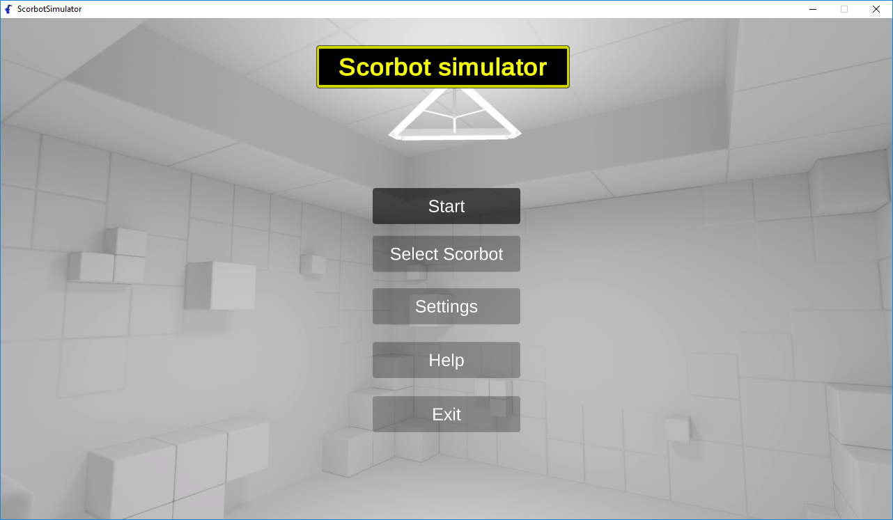
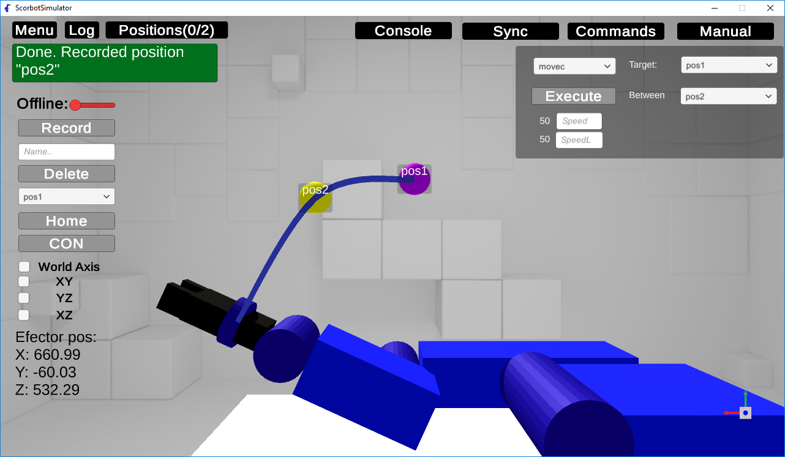

# **Scorbot Simulator** 
### Simulador de los brazos robóticos Scorbot ER IX y Scorbot ER V 	Plus

**Simulador - Interfaz gráfica**: Para ejecutar el programa seguir las instrucciones.
* Descargar la carpeta _"ScorbotSimulator"_
* Ejecutar el archivo _"ScorbotSimulator.exe"_
*  Para empezar pulsar _"Play!_.

**Entorno de desarrollo**:
* **Sistema operativo:** Windows 10 64 bits
* **Unity:** Unity 2017.4.1f1 Personal 64 bits
* **Blender:** Blender 2.79
* **Microsoft Visual Studio Community 2017:** 15.8.7

**Documentacion:** https://alu0100825893.github.io/ScorbotSimulator/Docs/html/annotated.html
*	**Doxygen** (instalar): http://www.doxygen.nl/download.html
*	**Generación de documentación** (consola): Comando "doxygen Doxyfile" dentro de ruta "...../Scripts/"
*	**Salida:** ../../Docs

**Iconos:** https://www.flaticon.com/

